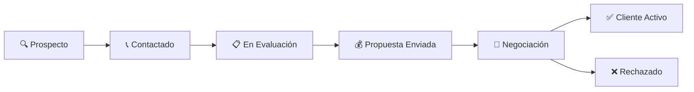

# Descripción Detallada del CRM y Herramientas de Análisis

> **Proyecto:** 9001app-firebase  
> **Fecha de Análisis:** 2026-01-07

---

## 📋 Resumen Ejecutivo

El sistema incluye un **CRM B2B** completo con integración **Twilio/WhatsApp**, análisis de riesgo crediticio mediante **scoring propio** e integración con **Nosis** (bureau de crédito argentino), aplicación móvil **PWA** para vendedores, y métricas de penetración de mercado alineadas con **ISO 9001:2015**.

---

## 🗂️ Estructura del Módulo CRM

```
src/app/(dashboard)/crm/
├── page.tsx                    # Vista Kanban principal
├── clientes/[id]/page.tsx      # Detalle del cliente
├── metricas/page.tsx           # Métricas de penetración
└── configuracion/              # Configuración Kanban

src/components/crm/
├── NuevoClienteDialog.tsx      # Alta de clientes
├── MobileFilters.tsx           # Filtros responsive
├── nosis/                      # Integración Nosis
├── legajo/                     # Legajo fiscal
└── historico/                  # Historial financiero

src/types/crm.ts                # 570 líneas de tipos
```

---

## 📞 1. Integración Twilio/WhatsApp

### [TwilioClient.ts](file:///c:/Users/Usuario/Documents/Proyectos/ISO -conjunto/9001app-firebase/src/services/whatsapp/TwilioClient.ts)

El cliente Twilio implementa la **WhatsApp Business API** con las siguientes funcionalidades:

### Funciones Implementadas

| Función | Descripción |
|---------|-------------|
| `sendWhatsAppMessage()` | Envía mensajes de texto y/o multimedia |
| `sendWhatsAppTemplate()` | Envía plantillas pre-aprobadas |
| `getMessageStatus()` | Consulta estado del mensaje (sent, delivered, read) |
| `isIn24HourWindow()` | Valida ventana de 24h para mensajes libres |
| `parseWebhookPayload()` | Parsea webhooks entrantes |

### Características Técnicas

```typescript
// Formato requerido: whatsapp:+549XXXXXXXXXX
export function formatWhatsAppNumber(phone: string): string {
  let cleaned = phone.replace(/\D/g, '');
  if (!cleaned.startsWith('54') && cleaned.length === 10) {
    cleaned = '54' + cleaned;
  }
  return `whatsapp:+${cleaned}`;
}
```

- **Autenticación:** Basic Auth con Account SID + Auth Token
- **Variables de entorno:** `TWILIO_ACCOUNT_SID`, `TWILIO_AUTH_TOKEN`, `TWILIO_WHATSAPP_NUMBER`
- **Ventana 24h:** WhatsApp solo permite mensajes libres durante 24h después del último mensaje del usuario
- **Templates:** Para contacto fuera de ventana, se usan templates aprobados por Meta

### WhatsAppButton en Cliente

Desde la ficha del cliente (`/crm/clientes/[id]`), hay un botón directo para:
- Iniciar conversación WhatsApp
- Ver historial de mensajes
- Enviar templates de cobranza/seguimiento

---

## 💼 2. Proceso de Ventas (Pipeline Kanban)

### [CRM Page](file:///c:/Users/Usuario/Documents/Proyectos/ISO -conjunto/9001app-firebase/src/app/(dashboard)/crm/page.tsx)

El proceso de ventas está implementado como un **tablero Kanban** visual con drag-and-drop:



### Estados Kanban Personalizables

La interfaz `EstadoClienteKanban` define:

```typescript
interface EstadoClienteKanban {
  id: string;
  nombre: string;           // Ej: "Prospecto", "Contactado"
  color: string;            // Color hex para visualización
  orden: number;            // Posición en el tablero
  organization_id: string;  // Multi-tenant
  es_estado_final: boolean; // "Cliente Activo", "Rechazado"
  permite_edicion: boolean; // Estados del sistema protegidos
}
```

### Flujo del Pipeline

1. **Alta de Lead:** Diálogo `NuevoClienteDialog` captura datos básicos
2. **Clasificación:** Se asigna tipo de cliente:
   - `posible_cliente` - Lead sin compras
   - `cliente_frecuente` - ≥3 compras en 12 meses
   - `cliente_antiguo` - Sin compras >12 meses
3. **Movimiento Kanban:** Drag & drop actualiza estado via API `/api/crm/kanban/mover`
4. **Historial:** Cada movimiento se registra con fecha, usuario y motivo

### Filtros Disponibles

- **Por Vendedor:** Responsable asignado
- **Por Tipo:** Posible/Frecuente/Antiguo
- **Por Zona:** Provincia/Localidad
- **Por Riesgo:** Categoría A/B/C/D/E

### Tarjeta de Cliente Premium

Cada tarjeta muestra:
- Razón social y nombre comercial
- Badge de categoría de riesgo (con gradiente de color)
- Monto estimado de compra
- Responsable asignado
- Indicador de tipo de cliente

---

## 🎯 3. Análisis de Riesgo Crediticio

### Sistema de Scoring Propio

El sistema implementa un **scoring crediticio** basado en 5 categorías:

```typescript
enum CategoriaRiesgo {
  A = 'A', // 8.00 - 10.00: Riesgo muy bueno (🏆 Premium)
  B = 'B', // 6.00 - 7.99: Riesgo aceptable (✓ Confiable)
  C = 'C', // 4.00 - 5.99: Riesgo moderado (⚠ Moderado)
  D = 'D', // 2.00 - 3.99: Riesgo malo (⚡ Alto)
  E = 'E', // 0.00 - 1.99: Riesgo muy malo (🚫 Crítico)
}
```

### Factores de Evaluación

El scoring pondera 3 factores principales:

| Factor | Peso | Indicadores |
|--------|------|-------------|
| **Capacidad de Pago** | ~40% | Ventas anuales, ratio compromiso, liquidez corriente |
| **Comportamiento de Pago** | ~30% | Histórico pagos puntuales, índice morosidad |
| **Solvencia Patrimonial** | ~30% | Patrimonio total (muebles, inmuebles, maquinaria) |

### Datos Financieros Capturados

```typescript
interface DatosFinancieros {
  // Liquidez
  activo_corriente: number;
  pasivo_corriente: number;
  liquidez_corriente?: number; // activo_corriente / pasivo_corriente
  
  // Capacidad de pago
  ventas_anuales: number;
  deudas_totales: number;
  ratio_compromiso?: number; // deudas_totales / ventas_anuales
  
  // Capacidad productiva (Agro)
  hectareas_cultivadas?: number;
  capacidad_productiva_porcentaje: number;
  
  // Solvencia patrimonial
  bienes_muebles: number;
  maquinaria_agricola: number;
  inmuebles: number;
  
  // Comportamiento histórico
  historico_pagos_puntuales: number; // 0-100%
  indice_morosidad: number;          // 0-100%
}
```

### Línea de Crédito Calculada

El resultado del scoring genera automáticamente:

```typescript
interface LineaCredito {
  capacidad_operativa: number;      // ventas * % afectación
  capital_disponible: number;       // patrimonio * relación permitida
  limite_credito_final: number;     // MIN(operativa, capital)
  limite_incremental: number;       // +5% por buen comportamiento
  monto_utilizado: number;
  monto_disponible: number;
  porcentaje_utilizacion: number;
  estado: 'vigente' | 'vencida' | 'suspendida' | 'cancelada';
}
```

---

## 🔍 4. Integración Nosis (Bureau de Crédito)

### [ConsultarNosisButton.tsx](file:///c:/Users/Usuario/Documents/Proyectos/ISO -conjunto/9001app-firebase/src/components/crm/nosis/ConsultarNosisButton.tsx)

Nosis es el bureau de información crediticia más usado en Argentina. La integración permite:

### Tipos de Consulta

| Tipo | Descripción |
|------|-------------|
| `nosis_score` | Solo puntaje crediticio |
| `veraz` | Información comercial básica |
| `situacion_crediticia` | Central de deudores BCRA |
| `completo` | Todos los datos disponibles |

### Datos Recuperados

```typescript
interface NosisResultado {
  score: number;  // 0-1000
  
  bcra: {
    situacionActual: number;  // 1=Normal, 2-5=Irregular
  };
  
  cheques: {
    rechazados: number;
  };
  
  juicios: {
    activos: number;
  };
  
  concursos: {
    presentados: boolean;
  };
}
```

### Mapeo Score → Categoría

```typescript
const getScoreCategoria = (score: number) => {
  if (score >= 800) return { label: 'A', color: 'bg-green-100' };
  if (score >= 600) return { label: 'B', color: 'bg-blue-100' };
  if (score >= 400) return { label: 'C', color: 'bg-yellow-100' };
  if (score >= 200) return { label: 'D', color: 'bg-orange-100' };
  return { label: 'E', color: 'bg-red-100' };
};
```

> ⚠️ **Nota:** Cada consulta Nosis consume una unidad del plan contratado y se registra para auditoría.

---

## 📊 5. Métricas de Penetración de Mercado

### [Métricas Page](file:///c:/Users/Usuario/Documents/Proyectos/ISO -conjunto/9001app-firebase/src/app/(dashboard)/crm/metricas/page.tsx)

Dashboard de KPIs alineado con **ISO 9001:2015** (cláusulas 9.1.2, 9.1.3, 10.2):

### KPIs Principales

| Métrica | Descripción |
|---------|-------------|
| **Tasa de Conversión** | Oportunidades ganadas / abiertas × 100 |
| **Tasa de Retención** | Clientes activos / (activos + perdidos) × 100 |
| **Pipeline Total** | Suma montos estimados de oportunidades |
| **Sin Contacto 90d** | Clientes que requieren atención urgente |

### Distribuciones Analizadas

1. **Por Estado Kanban:** Cuántos clientes en cada columna
2. **Por Categoría de Riesgo:** Distribución A/B/C/D/E
3. **Clientes No Atendidos:** Tabla con días sin contacto y prioridad

### Cumplimiento ISO 9001

```
┌─────────────────┬───────────────────────────────────────┐
│ Cláusula 9.1.2  │ Satisfacción del Cliente              │
│                 │ → Tasa de retención monitoreada       │
├─────────────────┼───────────────────────────────────────┤
│ Cláusula 9.1.3  │ Análisis y Evaluación                 │
│                 │ → Categorías de riesgo monitoreadas   │
├─────────────────┼───────────────────────────────────────┤
│ Cláusula 10.2   │ Acciones Correctivas                  │
│                 │ → Clientes sin atender identificados  │
└─────────────────┴───────────────────────────────────────┘
```

---

## 📱 6. Aplicación Móvil para Vendedores (PWA)

### [Vendedor App](file:///c:/Users/Usuario/Documents/Proyectos/ISO -conjunto/9001app-firebase/src/app/(dashboard)/vendedor/page.tsx)

Aplicación **Progressive Web App** optimizada para uso en campo con soporte **offline-first**.

### Estructura

```
src/app/(dashboard)/vendedor/
├── page.tsx              # Dashboard vendedor
├── layout.tsx            # Layout móvil
├── clientes/             # Lista de clientes asignados
├── perfil/               # Perfil del vendedor
└── sync/                 # Estado de sincronización
```

### Funcionalidades Principales

#### Dashboard Vendedor
- Estadísticas del día/semana
- Visitas recientes con resultado
- Próximas visitas programadas
- Botón grande "Nueva Visita"

#### Captura de Visitas

```typescript
interface VisitaLocal {
  id: string;
  clienteId: string;
  fecha: string;
  tipo: 'visita_campo' | 'visita_oficina' | 'llamada' | 'videollamada';
  objetivo: string;
  resultado?: 'exitosa' | 'sin_contacto' | 'reprogramar' | 'cancelada';
  
  // Ubicación GPS
  ubicacionInicio?: UbicacionGPS;
  ubicacionFin?: UbicacionGPS;
  
  // Evidencias
  fotosIds: string[];
  audiosIds: string[];
  
  // Checklist configurable
  checklist: ChecklistItem[];
  
  // Firma del cliente
  firmaCliente?: string; // Base64
  
  // Estado offline
  syncStatus: 'pending' | 'syncing' | 'synced' | 'error';
}
```

#### Captura GPS

```typescript
interface UbicacionGPS {
  lat: number;
  lng: number;
  accuracy: number;
  altitude?: number;
  timestamp: string;
}
```

#### Evidencias Multimedia

| Tipo | Almacenamiento | Sincronización |
|------|----------------|----------------|
| **Fotos** | IndexedDB (blob) | Baja prioridad (3) |
| **Audios** | IndexedDB con transcripción | Media prioridad (2) |
| **Datos** | IndexedDB | Alta prioridad (1) |

### Configuración del Vendedor

```typescript
interface VendedorConfig {
  autoGPS: boolean;                    // Captura automática
  compresionFotos: 'alta' | 'media' | 'baja';
  maxFotosPorVisita: number;
  syncOnlyWifi: boolean;               // Solo sync con WiFi
  syncInterval: number;                // Minutos entre sync
  theme: 'light' | 'dark' | 'system';
}
```

### Motor de Sincronización

```typescript
interface SyncQueueItem {
  tipo: 'visita' | 'foto' | 'audio';
  prioridad: 1 | 2 | 3;  // 1=alta, 2=media, 3=baja
  intentos: number;
  maxIntentos: number;
  ultimoError?: string;
  nextRetryAt?: string;
}
```

---

## 🧾 7. Legajo Fiscal

### Componente [LegajoFiscalPanel](file:///c:/Users/Usuario/Documents/Proyectos/ISO -conjunto/9001app-firebase/src/components/crm/legajo/)

Gestión documental fiscal del cliente:

- **Constancia de CUIT**
- **Constancia de Inscripción AFIP**
- **Balances contables**
- **Declaraciones juradas**
- **Escrituras de inmuebles**
- **Títulos de maquinaria**

---

## 📈 8. Historial Financiero

### Componente [HistorialFinanciero](file:///c:/Users/Usuario/Documents/Proyectos/ISO -conjunto/9001app-firebase/src/components/crm/historico/)

Tracking de:
- Evolución del scoring en el tiempo
- Cambios en línea de crédito
- Operaciones crediticias (uso/pago/ajuste)
- Snapshots de datos financieros para auditoría

---

## 🔒 Consideraciones de Seguridad

1. **Multi-Tenancy:** Todos los datos están segregados por `organization_id`
2. **Auditoría:** Consultas Nosis y cambios de estado se registran
3. **WhatsApp:** Validación de webhooks pendiente de implementar completamente
4. **Offline:** Los datos sensibles se almacenan cifrados en IndexedDB

---

## 📚 Archivos de Referencia

| Archivo | Líneas | Contenido |
|---------|--------|-----------|
| [crm.ts](file:///c:/Users/Usuario/Documents/Proyectos/ISO -conjunto/9001app-firebase/src/types/crm.ts) | 570 | Tipos TypeScript completos |
| [vendedor.ts](file:///c:/Users/Usuario/Documents/Proyectos/ISO -conjunto/9001app-firebase/src/types/vendedor.ts) | 240 | Tipos App Móvil |
| [TwilioClient.ts](file:///c:/Users/Usuario/Documents/Proyectos/ISO -conjunto/9001app-firebase/src/services/whatsapp/TwilioClient.ts) | 310 | Cliente WhatsApp |
| [CRM page](file:///c:/Users/Usuario/Documents/Proyectos/ISO -conjunto/9001app-firebase/src/app/(dashboard)/crm/page.tsx) | 567 | Vista Kanban |
| [Cliente detalle](file:///c:/Users/Usuario/Documents/Proyectos/ISO -conjunto/9001app-firebase/src/app/(dashboard)/crm/clientes/[id]/page.tsx) | 455 | Ficha Cliente |
| [Métricas](file:///c:/Users/Usuario/Documents/Proyectos/ISO -conjunto/9001app-firebase/src/app/(dashboard)/crm/metricas/page.tsx) | 400 | Dashboard ISO |
| [Vendedor](file:///c:/Users/Usuario/Documents/Proyectos/ISO -conjunto/9001app-firebase/src/app/(dashboard)/vendedor/page.tsx) | 253 | App Móvil |
