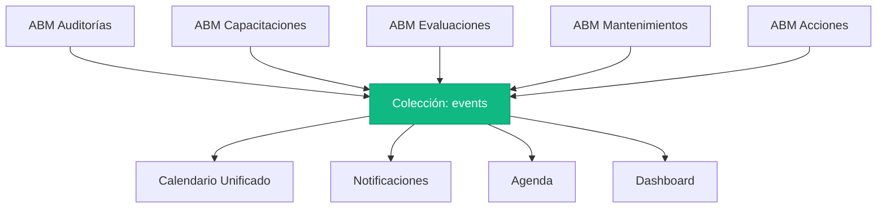

# 📅 Plan de Unificación de Eventos - Don Cándido

## Objetivo
Implementar una arquitectura de **Registro Único de Eventos** centralizada, ejecutando una migración segura en dos fases.

---

## Arquitectura Propuesta



---

## FASE 1: Estructura y Visualización

### 1.1 Diseño de la Colección `events`

#### Esquema JSON Principal

```typescript
interface Event {
  // === IDENTIFICACIÓN ===
  id: string;                          // ID auto-generado por Firestore
  organization_id: string;             // Multi-tenant
  
  // === INFORMACIÓN BÁSICA ===
  titulo: string;                      // Título del evento
  descripcion?: string;                // Descripción opcional
  tipo_evento: TipoEvento;             // Enum de tipos
  
  // === FECHAS ===
  fecha_inicio: Timestamp;             // Fecha/hora de inicio
  fecha_fin?: Timestamp;               // Fecha/hora de fin (opcional)
  todo_el_dia: boolean;                // Si es evento de día completo
  
  // === RESPONSABLES ===
  responsable_id: string;              // ID del responsable principal
  responsable_nombre: string;          // Nombre desnormalizado
  participantes_ids?: string[];        // IDs de participantes
  
  // === ESTADO Y PRIORIDAD ===
  estado: EstadoEvento;                // pendiente, en_progreso, completado, cancelado
  prioridad: PrioridadEvento;          // baja, media, alta, critica
  
  // === REFERENCIA AL ORIGEN ===
  origen: {
    modulo: ModuloOrigen;              // El módulo que lo creó
    coleccion: string;                 // Nombre de la colección origen
    documento_id: string;              // ID del documento relacionado
    numero_referencia?: string;        // Ej: "AUD-2026-001"
  };
  
  // === METADATA ESPECÍFICA ===
  meta: Record<string, any>;           // Datos específicos del tipo de evento
  
  // === CONTROL ===
  activo: boolean;                     // Soft delete
  recurrente: boolean;                 // Si es evento recurrente
  regla_recurrencia?: string;          // RRULE format (ej: "FREQ=WEEKLY;BYDAY=MO")
  
  // === AUDITORÍA ===
  created_at: Timestamp;
  updated_at: Timestamp;
  created_by: string;
  created_by_nombre: string;
}
```

#### Tipos y Enums

```typescript
type TipoEvento = 
  | 'auditoria'
  | 'capacitacion'
  | 'evaluacion'
  | 'mantenimiento'
  | 'accion_correctiva'
  | 'accion_preventiva'
  | 'reunion'
  | 'documento_vencimiento'
  | 'otro';

type ModuloOrigen = 
  | 'audits'
  | 'trainings'
  | 'evaluations'
  | 'maintenance'
  | 'actions'
  | 'documents'
  | 'manual';

type EstadoEvento = 
  | 'programado'
  | 'en_progreso'
  | 'completado'
  | 'cancelado'
  | 'postergado';

type PrioridadEvento = 
  | 'baja'
  | 'media'
  | 'alta'
  | 'critica';
```

#### Ejemplo de Documento

```json
{
  "id": "evt_2026_001",
  "organization_id": "org_los_senores_del_agro",
  
  "titulo": "Auditoría Interna ISO 9001",
  "descripcion": "Auditoría de sistema de gestión de calidad",
  "tipo_evento": "auditoria",
  
  "fecha_inicio": "2026-01-25T08:00:00Z",
  "fecha_fin": "2026-01-25T17:00:00Z",
  "todo_el_dia": false,
  
  "responsable_id": "user_roberto",
  "responsable_nombre": "Roberto García",
  "participantes_ids": ["user_ramiro", "user_beto"],
  
  "estado": "programado",
  "prioridad": "alta",
  
  "origen": {
    "modulo": "audits",
    "coleccion": "auditorias",
    "documento_id": "aud_2026_001",
    "numero_referencia": "AUD-2026-001"
  },
  
  "meta": {
    "norma": "ISO 9001:2015",
    "tipo_auditoria": "interna",
    "procesos_a_auditar": ["Producción", "Calidad"],
    "auditor_lider": "Juan Pérez"
  },
  
  "activo": true,
  "recurrente": false,
  
  "created_at": "2026-01-10T10:00:00Z",
  "updated_at": "2026-01-10T10:00:00Z",
  "created_by": "user_roberto",
  "created_by_nombre": "Roberto García"
}
```

---

### 1.2 Configuración Visual del Calendario

#### Colores por Tipo de Evento

| Tipo | Color | Ícono |
|------|-------|-------|
| Auditoría | `#EF4444` (rojo) | 🔍 |
| Capacitación | `#3B82F6` (azul) | 📚 |
| Evaluación | `#8B5CF6` (violeta) | 📋 |
| Mantenimiento | `#F59E0B` (naranja) | 🔧 |
| Acción Correctiva | `#DC2626` (rojo oscuro) | ⚠️ |
| Acción Preventiva | `#10B981` (verde) | ✅ |
| Reunión | `#6B7280` (gris) | 👥 |
| Documento Vencimiento | `#EC4899` (rosa) | 📄 |
| Otro | `#6B7280` (gris) | 📌 |

---

### 1.3 Datos de Prueba (Seeding)

Se creará el script `scripts/seed-unified-events.ts` con 10 eventos de prueba:

| # | Tipo | Título | Fecha | Estado |
|---|------|--------|-------|--------|
| 1 | Auditoría | Auditoría Interna ISO 9001 | 25 Ene | Programado |
| 2 | Auditoría | Auditoría de Procesos | 30 Ene | Programado |
| 3 | Capacitación | Seguridad Industrial | 15 Ene | Programado |
| 4 | Capacitación | ISO 9001:2015 Fundamentos | 22 Ene | Programado |
| 5 | Capacitación | Primeros Auxilios | 28 Ene | Programado |
| 6 | Evaluación | Desempeño Trimestral | 20 Ene | Programado |
| 7 | Mantenimiento | Mantenimiento Preventivo Equipos | 18 Ene | Programado |
| 8 | Mantenimiento | Calibración Instrumentos | 24 Ene | Programado |
| 9 | Mantenimiento | Revisión Instalaciones | 31 Ene | Programado |
| 10 | Reunión | Reunión de Mejora Continua | 10 Ene | Completado |

---

## FASE 2: Integración con ABMs (Después de aprobar Fase 1)

### 2.1 Orden de Integración Sugerido

1. **Mantenimiento** (más simple, buen punto de partida)
2. **Capacitaciones**
3. **Evaluaciones**
4. **Auditorías**
5. **Acciones Correctivas/Preventivas**

### 2.2 Patrón de Integración

```typescript
// Al guardar en cualquier ABM:
async function saveMantenimiento(data: MantenimientoFormData) {
  // 1. Guardar el registro principal
  const mantenimientoRef = await db.collection('mantenimientos').add(data);
  
  // 2. Crear/actualizar el evento unificado
  await eventService.createOrUpdate({
    tipo_evento: 'mantenimiento',
    titulo: data.titulo,
    fecha_inicio: data.fecha_programada,
    origen: {
      modulo: 'maintenance',
      coleccion: 'mantenimientos',
      documento_id: mantenimientoRef.id
    },
    meta: {
      tipo_mantenimiento: data.tipo,
      equipo: data.equipo_id
    }
  });
  
  return mantenimientoRef.id;
}
```

### 2.3 Servicio Centralizado

Se creará `EventService` con métodos:
- `create(data)` - Crear evento
- `update(id, data)` - Actualizar evento
- `delete(id)` - Eliminar evento (soft delete)
- `getByDateRange(start, end, orgId)` - Obtener por rango
- `getByModule(modulo, documentoId)` - Obtener evento de un registro específico
- `syncFromSource(modulo, documentoId)` - Re-sincronizar desde origen

---

## Checklist de Implementación

### Fase 1 - Estructura y Visualización ✅ COMPLETADA
- [x] Crear tipo TypeScript `Event` y enums (`src/types/events.ts`)
- [x] Crear script de seeding `crear-eventos.ts`
- [x] Ejecutar seeding con datos de prueba (5 eventos)
- [x] Crear API `/api/events/range` para el calendario
- [x] Modificar Calendario para leer de `events`
- [x] Configurar colores por tipo de evento en `EventCard.tsx`
- [x] **VALIDADO CON USUARIO** ✅

### Fase 2 - Integración (En Progreso)
- [x] Crear `EventService.ts` (`src/services/events/EventService.ts`)
- [x] Integrar módulo **Capacitaciones** (trainings)
- [x] Integrar módulo **Evaluaciones** (evaluations)
- [ ] Integrar módulo Auditorías
- [ ] Integrar módulo Acciones Correctivas/Preventivas
- [ ] Integrar módulo Mantenimiento
- [ ] Migrar datos históricos

---

## Índices Firestore Requeridos

```json
{
  "collectionGroup": "events",
  "fields": [
    { "fieldPath": "organization_id", "order": "ASCENDING" },
    { "fieldPath": "fecha_inicio", "order": "ASCENDING" }
  ]
},
{
  "collectionGroup": "events",
  "fields": [
    { "fieldPath": "organization_id", "order": "ASCENDING" },
    { "fieldPath": "activo", "order": "ASCENDING" },
    { "fieldPath": "fecha_inicio", "order": "ASCENDING" }
  ]
}
```

---

## Notas Importantes

1. **No tocar ABMs actuales en Fase 1** - Solo se trabaja en visualización
2. **Datos de prueba manuales** - Sin afectar datos reales
3. **Validación obligatoria** - Usuario debe aprobar Fase 1 antes de Fase 2
4. **Migración gradual** - Un módulo a la vez en Fase 2
5. **Reversibilidad** - Mantener colecciones originales como backup

---

*Documento creado: 2026-01-04*
*Última actualización: 2026-01-04*
