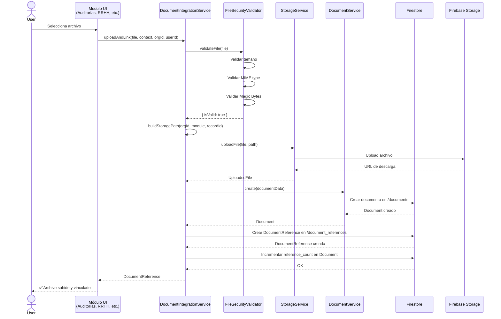
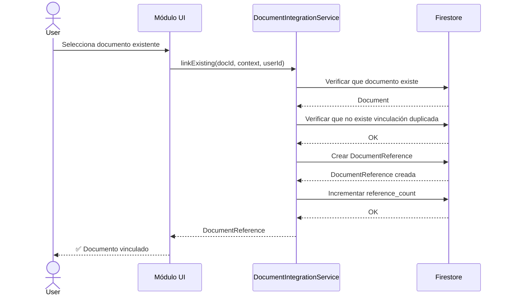
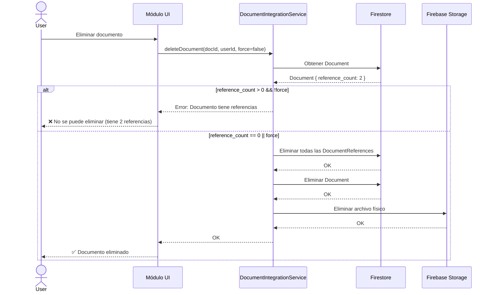
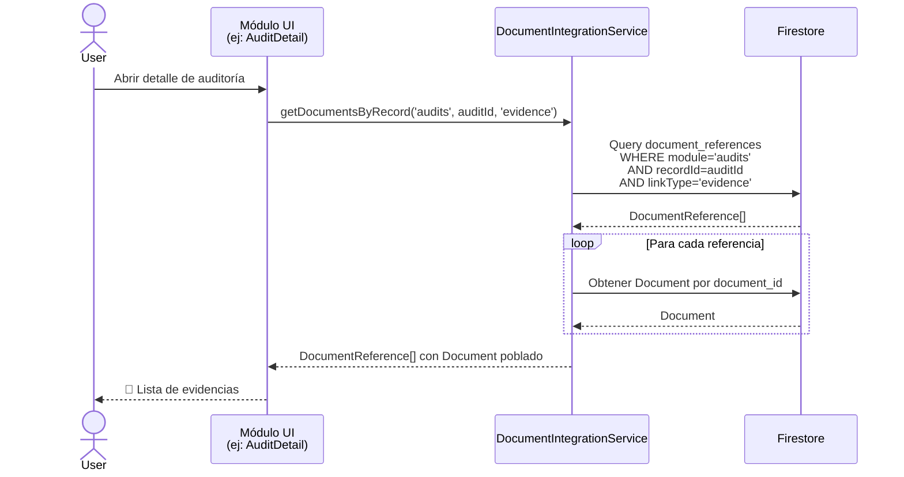
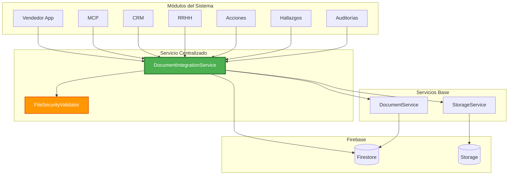

# Sistema de Servicio Documental Centralizado

> **Arquitecto:** Sistema de Integración Documental para Don Cándido IA  
> **Fecha:** 2026-01-05  
> **Versión:** 1.0  
> **Stack:** Next.js 14 + Firebase + TypeScript

---

## 📋 Tabla de Contenidos

1. [Contexto y Problemática](#contexto-y-problemática)
2. [Objetivos del Servicio](#objetivos-del-servicio)
3. [Análisis del Modelo Actual](#análisis-del-modelo-actual)
4. [Diseño del Servicio](#diseño-del-servicio)
5. [Modelo de Datos Extendido](#modelo-de-datos-extendido)
6. [Estrategia de Almacenamiento](#estrategia-de-almacenamiento)
7. [Seguridad y Validación](#seguridad-y-validación)
8. [Casos de Uso](#casos-de-uso)
9. [Plan de Refactorización](#plan-de-refactorización)
10. [Diagrama de Flujo](#diagrama-de-flujo)

---

## 🎯 Contexto y Problemática

### Situación Actual

Don Cándido IA es un SaaS para gestión de ISO 9001 con **múltiples módulos** que manejan documentos:

| Módulo | Manejo Documental Actual | Problemática |
|--------|-------------------------|--------------|
| **Auditorías** | Upload directo a Storage (`evidence/audits/{id}`) | Sin registro centralizado en Firestore |
| **Hallazgos** | Upload directo a Storage (`evidence/findings/{id}`) | Duplicación de lógica de validación |
| **Acciones** | Upload directo a Storage (`evidence/actions/{id}`) | No hay gestión de huérfanos |
| **RRHH** | Upload a Storage (`organizations/{orgId}/rrhh/{subcat}/{id}`) | Sin vínculo a documentos existentes |
| **CRM** | Subcollection `clientes/{id}/documentos` | Aislado del resto del sistema |
| **Documentos** | Collection `documents` con `DocumentService` | **Servicio más completo pero no reutilizable** |
| **MCP** | Upload de evidencias (`mcp_executions/{id}/evidencias`) | Sin estandarización |
| **Vendedor App** | Upload de fotos/audios (`visitas_vendedor/{id}`) | Offline-first, sin integración |

### Problemas Identificados

1. **Dispersión de Lógica**: Cada módulo implementa su propia lógica de upload/validación
2. **Duplicación de Código**: Validación de MIME types repetida en múltiples lugares
3. **Falta de Trazabilidad**: No hay un registro unificado de "qué documento pertenece a qué entidad"
4. **Gestión de Huérfanos**: Archivos en Storage sin referencias en Firestore
5. **Seguridad Inconsistente**: Validaciones de seguridad (Magic Bytes, MIME) no aplicadas uniformemente
6. **Imposibilidad de Reutilización**: No se pueden vincular documentos existentes a nuevas entidades

---

## 🎯 Objetivos del Servicio

El **`DocumentIntegrationService`** será un **servicio centralizado** que actúe como una **API interna** ("enchufe") para:

### Funcionalidades Core

1. ✅ **Insertar Documentos**: Upload + Registro en Firestore con contexto de módulo
2. ✅ **Vincular Documentos Existentes**: Referenciar sin duplicar archivos
3. ✅ **Eliminar Documentos**: Gestión inteligente de huérfanos (solo eliminar si no hay referencias)
4. ✅ **Consultar Documentos**: Obtener documentos asociados a una entidad
5. ✅ **Validación Centralizada**: MIME types + Magic Bytes en un solo lugar
6. ✅ **Auditoría Completa**: Registro de quién, cuándo y desde dónde se subió/vinculó

### Beneficios

- **Reutilización**: Un solo servicio para todos los módulos
- **Consistencia**: Mismas reglas de validación en todo el sistema
- **Trazabilidad**: Saber qué documentos están vinculados a qué entidades
- **Seguridad**: Validación robusta centralizada (OWASP File Upload)
- **Mantenibilidad**: Cambios en un solo lugar

---

## 📊 Análisis del Modelo Actual

### Interfaz `Document` Actual

```typescript
// src/types/documents.ts (ACTUAL)
export interface Document {
  id: string;
  
  // Identificación
  organization_id: string; // MULTI-TENANT
  code: string;
  title: string;
  description?: string;
  keywords?: string[];
  
  // Clasificación
  type: DocumentType;
  category?: string;
  
  // Estado y versión
  status: DocumentStatus;
  version: string;
  
  // Responsabilidad
  responsible_user_id: string;
  distribution_list?: string[];
  
  // Relaciones (LIMITADAS)
  iso_clause?: string;
  process_id?: string;
  norm_point_ids?: string[];
  
  // Archivo
  file_path?: string;
  file_size?: number;
  mime_type?: string;
  download_url?: string;
  
  // Fechas
  effective_date?: Date;
  review_date?: Date;
  approved_at?: Date;
  approved_by?: string;
  
  // Auditoría
  download_count: number;
  is_archived: boolean;
  created_at: Date;
  updated_at: Date;
  created_by: string;
  updated_by: string;
}
```

### Limitaciones del Modelo Actual

| Limitación | Descripción | Impacto |
|------------|-------------|---------|
| **Sin contexto de módulo** | No hay campo `source_module` | No se sabe desde dónde se subió |
| **Sin referencias externas** | No hay `linked_record_id` | No se pueden vincular a auditorías, hallazgos, etc. |
| **Sin tipo de vinculación** | No hay `link_type` | No se distingue entre "evidencia", "informe", "adjunto" |
| **Sin gestión de referencias** | No hay contador de referencias | No se sabe si un documento está siendo usado |
| **Validación limitada** | Solo MIME type, sin Magic Bytes | Vulnerabilidad a ataques de file upload |

---

## 🏗️ Diseño del Servicio

### Arquitectura del Servicio

```typescript
// src/services/documents/DocumentIntegrationService.ts

import { Document, DocumentCreateData } from '@/types/documents';
import { DocumentReference, UploadedFile } from '@/types/storage';
import { DocumentService } from './DocumentService';
import { StorageService } from '../storage/StorageService';
import { FileSecurityValidator } from '@/lib/security/FileSecurityValidator';

/**
 * Contexto de vinculación de un documento
 */
export interface DocumentLinkContext {
  /** Módulo de origen (audits, findings, actions, rrhh, crm, etc.) */
  module: DocumentModule;
  
  /** ID del registro al que se vincula */
  recordId: string;
  
  /** Tipo de vinculación (evidencia, informe, adjunto, etc.) */
  linkType: DocumentLinkType;
  
  /** Etiqueta descriptiva opcional */
  tag?: string;
  
  /** Metadata adicional específica del módulo */
  metadata?: Record<string, any>;
}

/**
 * Servicio centralizado para integración documental
 * Actúa como "enchufe" para todos los módulos
 */
export class DocumentIntegrationService {
  
  // ============================================
  // INSERTAR DOCUMENTOS (Upload + Registro)
  // ============================================
  
  /**
   * Sube un archivo y lo registra vinculado a una entidad
   * @param file - Archivo a subir
   * @param context - Contexto de vinculación
   * @param organizationId - ID de la organización
   * @param userId - ID del usuario que sube
   * @returns Documento creado con referencia
   */
  static async uploadAndLink(
    file: File,
    context: DocumentLinkContext,
    organizationId: string,
    userId: string
  ): Promise<DocumentReference>;
  
  /**
   * Sube múltiples archivos y los vincula a una entidad
   * @param files - Archivos a subir
   * @param context - Contexto de vinculación (mismo para todos)
   * @param organizationId - ID de la organización
   * @param userId - ID del usuario que sube
   * @returns Array de documentos creados
   */
  static async uploadAndLinkMultiple(
    files: File[],
    context: DocumentLinkContext,
    organizationId: string,
    userId: string
  ): Promise<DocumentReference[]>;
  
  // ============================================
  // VINCULAR DOCUMENTOS EXISTENTES
  // ============================================
  
  /**
   * Vincula un documento existente a una nueva entidad
   * (sin duplicar archivo)
   * @param documentId - ID del documento existente
   * @param context - Nuevo contexto de vinculación
   * @param userId - ID del usuario que vincula
   * @returns Referencia actualizada
   */
  static async linkExisting(
    documentId: string,
    context: DocumentLinkContext,
    userId: string
  ): Promise<DocumentReference>;
  
  /**
   * Desvincula un documento de una entidad
   * (no elimina el archivo si hay otras referencias)
   * @param documentId - ID del documento
   * @param context - Contexto a desvincular
   * @param userId - ID del usuario
   */
  static async unlink(
    documentId: string,
    context: Partial<DocumentLinkContext>,
    userId: string
  ): Promise<void>;
  
  // ============================================
  // CONSULTAR DOCUMENTOS
  // ============================================
  
  /**
   * Obtiene todos los documentos vinculados a una entidad
   * @param module - Módulo de origen
   * @param recordId - ID del registro
   * @param linkType - Tipo de vinculación (opcional)
   * @returns Array de referencias de documentos
   */
  static async getDocumentsByRecord(
    module: DocumentModule,
    recordId: string,
    linkType?: DocumentLinkType
  ): Promise<DocumentReference[]>;
  
  /**
   * Obtiene todas las entidades vinculadas a un documento
   * @param documentId - ID del documento
   * @returns Array de contextos de vinculación
   */
  static async getLinkedRecords(
    documentId: string
  ): Promise<DocumentLinkContext[]>;
  
  // ============================================
  // ELIMINAR DOCUMENTOS
  // ============================================
  
  /**
   * Elimina un documento (solo si no tiene referencias)
   * @param documentId - ID del documento
   * @param userId - ID del usuario
   * @param force - Forzar eliminación aunque tenga referencias
   */
  static async deleteDocument(
    documentId: string,
    userId: string,
    force?: boolean
  ): Promise<void>;
  
  /**
   * Limpia documentos huérfanos (sin referencias)
   * @param organizationId - ID de la organización
   * @returns Cantidad de documentos eliminados
   */
  static async cleanOrphans(
    organizationId: string
  ): Promise<number>;
  
  // ============================================
  // VALIDACIÓN Y SEGURIDAD
  // ============================================
  
  /**
   * Valida un archivo antes de subirlo
   * (MIME type + Magic Bytes + Tamaño)
   * @param file - Archivo a validar
   * @param options - Opciones de validación
   */
  static async validateFile(
    file: File,
    options?: FileValidationOptions
  ): Promise<FileValidationResult>;
  
  /**
   * Genera un path de Storage estandarizado
   * @param organizationId - ID de la organización
   * @param module - Módulo de origen
   * @param recordId - ID del registro
   * @returns Path de Storage
   */
  static buildStoragePath(
    organizationId: string,
    module: DocumentModule,
    recordId: string
  ): string;
}
```

---

## 📦 Modelo de Datos Extendido

### Nueva Interfaz `DocumentReference`

```typescript
// src/types/documents.ts (EXTENDIDO)

/**
 * Módulos que pueden vincular documentos
 */
export type DocumentModule =
  | 'audits'
  | 'findings'
  | 'actions'
  | 'rrhh'
  | 'crm'
  | 'processes'
  | 'quality'
  | 'mcp'
  | 'vendedor'
  | 'documents' // Módulo de documentos standalone
  | 'other';

/**
 * Tipos de vinculación de documentos
 */
export type DocumentLinkType =
  | 'evidence' // Evidencia (fotos, capturas)
  | 'report' // Informe (PDF, Word)
  | 'attachment' // Adjunto genérico
  | 'certificate' // Certificado
  | 'contract' // Contrato
  | 'invoice' // Factura
  | 'photo' // Foto
  | 'audio' // Audio
  | 'video' // Video
  | 'other';

/**
 * Referencia de documento vinculado a una entidad
 * (Nueva colección: document_references)
 */
export interface DocumentReference {
  id: string;
  
  // Documento base
  document_id: string; // FK a documents
  organization_id: string; // MULTI-TENANT
  
  // Contexto de vinculación
  source_module: DocumentModule;
  linked_record_id: string;
  link_type: DocumentLinkType;
  tag?: string;
  
  // Metadata específica del módulo
  metadata?: {
    // Auditorías
    audit_type?: string;
    finding_severity?: string;
    
    // RRHH
    personnel_id?: string;
    training_id?: string;
    
    // CRM
    client_id?: string;
    
    // Otros
    [key: string]: any;
  };
  
  // Auditoría
  created_at: Date;
  created_by: string;
  updated_at: Date;
  updated_by: string;
}

/**
 * Documento extendido con contador de referencias
 */
export interface DocumentExtended extends Document {
  /** Cantidad de referencias activas */
  reference_count: number;
  
  /** Indica si es un documento huérfano */
  is_orphan: boolean;
}
```

### Nueva Colección Firestore

```
organizations/{orgId}/document_references/{refId}
├── document_id: string
├── organization_id: string
├── source_module: DocumentModule
├── linked_record_id: string
├── link_type: DocumentLinkType
├── tag?: string
├── metadata?: object
├── created_at: Timestamp
├── created_by: string
├── updated_at: Timestamp
└── updated_by: string
```

### Relación con Colección `documents`

```
documents/{docId}
├── (campos actuales)
├── reference_count: number (nuevo)
└── is_orphan: boolean (nuevo, calculado)

document_references/{refId}
└── document_id → FK a documents/{docId}
```

---

## 🎯 Mejoras Críticas (Recomendaciones Gemini 3)

> **Fecha de Revisión:** 2026-01-05  
> **Revisor:** Gemini 3 (Arquitecto Senior)  
> **Estado:** ✅ Aprobado con mejoras críticas

### 1. Optimización de Performance: Denormalización para Evitar N+1 Queries

#### Problema Identificado

En el diseño original, `getDocumentsByRecord()` realiza:
1. **1 query** a `document_references` (obtener referencias)
2. **N queries** a `documents` (uno por cada referencia)

**Ejemplo:** Una auditoría con 20 evidencias = **21 lecturas** a Firestore.

#### Solución: Snapshot Denormalizado

Copiar datos visuales básicos dentro de `DocumentReference`:

```typescript
export interface DocumentReference {
  id: string;
  
  // ... campos de relación ...
  
  // ✅ DENORMALIZACIÓN (Evita lecturas extra)
  snapshot: {
    title: string;
    mime_type: string;
    file_extension: string;
    download_url: string;
    size_bytes: number;
    thumbnail_url?: string; // Para imágenes
  };
  
  // ... resto de campos ...
}
```

#### Beneficios

- ✅ **1 sola query** obtiene todo lo necesario para la UI
- ✅ Solo se lee el documento "padre" si el usuario hace clic en detalles
- ✅ Reducción de **95% en lecturas** de Firestore
- ✅ Mejora significativa en velocidad de carga

#### Estrategia de Sincronización

Cuando se actualiza un `Document`, actualizar todos sus `DocumentReference.snapshot`:

```typescript
static async updateDocumentAndReferences(
  documentId: string,
  updates: Partial<Document>
): Promise<void> {
  const batch = db.batch();
  
  // Actualizar documento
  const docRef = doc(db, 'documents', documentId);
  batch.update(docRef, updates);
  
  // Actualizar snapshots en todas las referencias
  const refsQuery = query(
    collection(db, 'document_references'),
    where('document_id', '==', documentId)
  );
  const refs = await getDocs(refsQuery);
  
  refs.forEach(refDoc => {
    batch.update(refDoc.ref, {
      'snapshot.title': updates.title,
      'snapshot.mime_type': updates.mime_type,
      // ... otros campos relevantes
    });
  });
  
  await batch.commit();
}
```

---

### 2. Integridad Transaccional del Contador

#### Problema Identificado

**Race Condition** en `reference_count`:
- Usuario A elimina referencia → lee count=2, escribe count=1
- Usuario B elimina referencia → lee count=2, escribe count=1
- **Resultado:** count=1 pero deberían ser 0 referencias

#### Solución: Transacciones Obligatorias

```typescript
static async linkExisting(
  documentId: string,
  context: DocumentLinkContext,
  userId: string
): Promise<DocumentReference> {
  return await db.runTransaction(async (transaction) => {
    const docRef = doc(db, 'documents', documentId);
    const docSnap = await transaction.get(docRef);
    
    if (!docSnap.exists()) {
      throw new Error('Documento no encontrado');
    }
    
    // Crear referencia
    const refRef = doc(collection(db, 'document_references'));
    const refData = {
      document_id: documentId,
      source_module: context.module,
      linked_record_id: context.recordId,
      // ... resto de campos
      created_at: Timestamp.now(),
      created_by: userId,
    };
    
    transaction.set(refRef, refData);
    
    // Incrementar contador ATÓMICAMENTE
    transaction.update(docRef, {
      reference_count: FieldValue.increment(1),
      is_orphan: false,
    });
    
    return { id: refRef.id, ...refData } as DocumentReference;
  });
}

static async unlink(
  documentId: string,
  context: Partial<DocumentLinkContext>,
  userId: string
): Promise<void> {
  return await db.runTransaction(async (transaction) => {
    // Buscar referencia
    const refsQuery = query(
      collection(db, 'document_references'),
      where('document_id', '==', documentId),
      where('source_module', '==', context.module),
      where('linked_record_id', '==', context.recordId)
    );
    
    const refs = await getDocs(refsQuery);
    if (refs.empty) {
      throw new Error('Referencia no encontrada');
    }
    
    const refDoc = refs.docs[0];
    
    // Verificar bloqueo ISO
    if (refDoc.data().is_locked) {
      throw new Error('No se puede desvincular: evidencia bloqueada por ISO 9001');
    }
    
    // Eliminar referencia
    transaction.delete(refDoc.ref);
    
    // Decrementar contador ATÓMICAMENTE
    const docRef = doc(db, 'documents', documentId);
    transaction.update(docRef, {
      reference_count: FieldValue.increment(-1),
    });
  });
}
```

---

### 3. Permisos de Storage Cruzados (Edge Case de Seguridad)

#### Problema Identificado

**Escenario:**
1. Documento subido en módulo "Confidencial" (solo admins)
2. Documento vinculado en módulo "Público"
3. Usuario público tiene referencia pero no puede descargar (archivo en carpeta restringida)

#### Solución A: Reglas de Storage a Nivel de Organización (Recomendado)

```javascript
// storage.rules
match /organizations/{orgId}/{allPaths=**} {
  allow read: if request.auth != null && 
                 isOrgMember(orgId);
  
  allow write: if request.auth != null && 
                  isOrgMember(orgId) &&
                  request.resource.size < 10 * 1024 * 1024;
}
```

**Ventajas:**
- ✅ Simple de implementar
- ✅ Consistente con multi-tenancy
- ✅ No requiere proxy

**Desventajas:**
- ⚠️ No hay seguridad granular por módulo

#### Solución B: Proxy de Descarga (Para Seguridad Granular)

```typescript
// src/app/api/documents/[id]/download/route.ts

export async function GET(
  request: Request,
  { params }: { params: { id: string } }
) {
  const session = await getServerSession(authOptions);
  if (!session) {
    return new Response('Unauthorized', { status: 401 });
  }
  
  const documentId = params.id;
  
  // Obtener documento
  const document = await DocumentService.getById(documentId);
  if (!document) {
    return new Response('Not found', { status: 404 });
  }
  
  // Verificar permisos lógicos
  const hasPermission = await checkDocumentPermission(
    session.user.id,
    document
  );
  
  if (!hasPermission) {
    return new Response('Forbidden', { status: 403 });
  }
  
  // Obtener archivo de Storage (server-side)
  const bucket = getAdminStorage().bucket();
  const file = bucket.file(document.file_path);
  
  const [buffer] = await file.download();
  
  return new Response(buffer, {
    headers: {
      'Content-Type': document.mime_type,
      'Content-Disposition': `attachment; filename="${document.title}"`,
    },
  });
}
```

**Recomendación:** Usar **Solución A** inicialmente. Implementar **Solución B** solo si se requiere seguridad granular por módulo.

---

### 4. Inmutabilidad de Evidencias (Critical ISO Requirement)

#### Requisito ISO 9001

La norma ISO 9001 **requiere proteger la evidencia** de auditorías y procesos cerrados.

#### Solución: Sistema de Bloqueo

```typescript
export interface DocumentReference {
  id: string;
  
  // ... campos existentes ...
  
  // ✅ CONTROL ISO 9001
  is_locked: boolean; // Si true, impide borrar el documento padre
  lock_reason?: string; // Ej: "Auditoría cerrada", "Proceso certificado"
  locked_at?: Date;
  locked_by?: string;
}
```

#### Implementación

```typescript
/**
 * Bloquea todas las referencias de una entidad
 * (Llamar cuando se cierra una auditoría, proceso, etc.)
 */
static async lockReferences(
  module: DocumentModule,
  recordId: string,
  reason: string,
  userId: string
): Promise<number> {
  const refsQuery = query(
    collection(db, 'document_references'),
    where('source_module', '==', module),
    where('linked_record_id', '==', recordId)
  );
  
  const refs = await getDocs(refsQuery);
  const batch = db.batch();
  
  refs.forEach(refDoc => {
    batch.update(refDoc.ref, {
      is_locked: true,
      lock_reason: reason,
      locked_at: Timestamp.now(),
      locked_by: userId,
    });
  });
  
  await batch.commit();
  return refs.size;
}

/**
 * Eliminar documento (validando bloqueos)
 */
static async deleteDocument(
  documentId: string,
  userId: string,
  force: boolean = false
): Promise<void> {
  // Verificar referencias bloqueadas
  const refsQuery = query(
    collection(db, 'document_references'),
    where('document_id', '==', documentId),
    where('is_locked', '==', true)
  );
  
  const lockedRefs = await getDocs(refsQuery);
  
  if (!lockedRefs.empty && !force) {
    const reasons = lockedRefs.docs.map(d => d.data().lock_reason).join(', ');
    throw new Error(
      `No se puede eliminar: documento bloqueado por ISO 9001. Razones: ${reasons}`
    );
  }
  
  // ... resto de lógica de eliminación
}
```

#### Integración con Módulos

```typescript
// En el módulo de Auditorías
async function closeAudit(auditId: string) {
  // 1. Cerrar auditoría
  await updateDoc(doc(db, 'audits', auditId), {
    status: 'cerrada',
    closed_at: Timestamp.now(),
  });
  
  // 2. Bloquear todas las evidencias
  const lockedCount = await DocumentIntegrationService.lockReferences(
    'audits',
    auditId,
    'Auditoría cerrada - Evidencia protegida por ISO 9001',
    userId
  );
  
  toast.success(`Auditoría cerrada. ${lockedCount} evidencias bloqueadas.`);
}
```

---

### 5. Versionado Real vs. Vinculación

#### Problema Identificado

**Pregunta:** Si actualizo "Procedimiento de Ventas" a V2.0, ¿las auditorías pasadas deben apuntar a V1.0 (histórico) o V2.0 (actual)?

#### Solución: Versionado Fijo Opcional

```typescript
export interface DocumentReference {
  id: string;
  
  // ... campos existentes ...
  
  // ✅ VERSIONADO
  fixed_version?: string; // Si existe, apunta a versión específica
                          // Si null, apunta a la última versión
}
```

#### Estrategia por Tipo de Vinculación

| Link Type | Comportamiento | Razón |
|-----------|---------------|-------|
| `evidence` | **Fijo** (`fixed_version` obligatorio) | Evidencia debe ser inmutable |
| `photo`, `audio`, `video` | **Fijo** | Capturas de momento específico |
| `report` | **Fijo** | Informe de auditoría específica |
| `certificate` | **Fijo** | Certificado emitido en fecha específica |
| `attachment` | **Flexible** | Puede ser fijo o vivo según contexto |
| `contract` | **Fijo** | Contrato firmado en versión específica |

#### Implementación

```typescript
static async uploadAndLink(
  file: File,
  context: DocumentLinkContext,
  organizationId: string,
  userId: string
): Promise<DocumentReference> {
  // ... lógica de upload ...
  
  // Crear documento
  const document = await DocumentService.create({
    // ... datos del documento
    version: '1.0',
  });
  
  // Determinar si debe ser versión fija
  const requiresFixedVersion = [
    'evidence',
    'photo',
    'audio',
    'video',
    'report',
    'certificate',
    'contract',
  ].includes(context.linkType);
  
  // Crear referencia
  const refData = {
    document_id: document.id,
    source_module: context.module,
    linked_record_id: context.recordId,
    link_type: context.linkType,
    fixed_version: requiresFixedVersion ? document.version : null,
    // ... resto de campos
  };
  
  // ... guardar referencia
}
```

#### Consulta con Versionado

```typescript
static async getDocumentsByRecord(
  module: DocumentModule,
  recordId: string,
  linkType?: DocumentLinkType
): Promise<DocumentReference[]> {
  // Obtener referencias
  const refs = await getDocs(/* query */);
  
  return refs.docs.map(refDoc => {
    const refData = refDoc.data();
    
    // Si tiene versión fija, usar snapshot histórico
    if (refData.fixed_version) {
      // El snapshot ya contiene los datos de esa versión
      return {
        id: refDoc.id,
        ...refData,
        snapshot: refData.snapshot, // Datos congelados
      };
    }
    
    // Si no tiene versión fija, podríamos actualizar el snapshot
    // con la última versión (opcional, según necesidad)
    return {
      id: refDoc.id,
      ...refData,
    };
  });
}
```

---

## 📊 Modelo de Datos Actualizado (Con Mejoras Gemini 3)

### Interfaz `DocumentReference` Final

```typescript
/**
 * Referencia de documento vinculado a una entidad
 * (Colección: document_references)
 * 
 * @version 2.0 - Con mejoras de Gemini 3
 */
export interface DocumentReference {
  id: string;
  
  // Documento base
  document_id: string; // FK a documents
  organization_id: string; // MULTI-TENANT
  
  // Contexto de vinculación
  source_module: DocumentModule;
  linked_record_id: string;
  link_type: DocumentLinkType;
  tag?: string;
  
  // ✅ DENORMALIZACIÓN (Gemini 3 - Performance)
  snapshot: {
    title: string;
    mime_type: string;
    file_extension: string;
    download_url: string;
    size_bytes: number;
    thumbnail_url?: string;
  };
  
  // ✅ CONTROL ISO 9001 (Gemini 3 - Compliance)
  is_locked: boolean;
  lock_reason?: string;
  locked_at?: Date;
  locked_by?: string;
  
  // ✅ VERSIONADO (Gemini 3 - Trazabilidad)
  fixed_version?: string; // Si null, apunta a última versión
  
  // Metadata específica del módulo
  metadata?: {
    audit_type?: string;
    finding_severity?: string;
    personnel_id?: string;
    training_id?: string;
    client_id?: string;
    [key: string]: any;
  };
  
  // Auditoría
  created_at: Date;
  created_by: string;
  updated_at: Date;
  updated_by: string;
}
```

### Interfaz `DocumentExtended` Final

```typescript
export interface DocumentExtended extends Document {
  /** Cantidad de referencias activas */
  reference_count: number;
  
  /** Indica si es un documento huérfano */
  is_orphan: boolean;
  
  /** Indica si tiene referencias bloqueadas (no se puede eliminar) */
  has_locked_references: boolean;
}
```

---

## 🗄️ Estrategia de Almacenamiento

### Estructura de Carpetas en Firebase Storage

```
organizations/
└── {organizationId}/
    ├── audits/
    │   └── {auditId}/
    │       ├── evidence/
    │       │   ├── {timestamp}_{filename}.jpg
    │       │   └── {timestamp}_{filename}.pdf
    │       └── reports/
    │           └── {timestamp}_informe.pdf
    │
    ├── findings/
    │   └── {findingId}/
    │       ├── evidence/
    │       └── attachments/
    │
    ├── actions/
    │   └── {actionId}/
    │       ├── evidence/
    │       └── reports/
    │
    ├── rrhh/
    │   ├── personnel/
    │   │   └── {personnelId}/
    │   │       ├── certificates/
    │   │       └── documents/
    │   ├── trainings/
    │   │   └── {trainingId}/
    │   │       └── materials/
    │   └── evaluations/
    │       └── {evaluationId}/
    │
    ├── crm/
    │   └── clientes/
    │       └── {clienteId}/
    │           ├── contracts/
    │           ├── invoices/
    │           └── documents/
    │
    ├── mcp/
    │   └── executions/
    │       └── {executionId}/
    │           └── evidence/
    │
    ├── vendedor/
    │   └── visitas/
    │       └── {visitaId}/
    │           ├── photos/
    │           └── audios/
    │
    └── documents/
        └── standalone/
            └── {documentId}/
```

### Reglas de Path

```typescript
/**
 * Genera path de Storage estandarizado
 */
static buildStoragePath(
  organizationId: string,
  module: DocumentModule,
  recordId: string,
  linkType?: DocumentLinkType
): string {
  const base = `organizations/${organizationId}`;
  
  // Mapeo de módulo a subcarpeta
  const moduleMap: Record<DocumentModule, string> = {
    audits: 'audits',
    findings: 'findings',
    actions: 'actions',
    rrhh: 'rrhh',
    crm: 'crm/clientes',
    processes: 'processes',
    quality: 'quality',
    mcp: 'mcp/executions',
    vendedor: 'vendedor/visitas',
    documents: 'documents/standalone',
    other: 'other',
  };
  
  // Mapeo de linkType a subcarpeta
  const linkTypeMap: Record<DocumentLinkType, string> = {
    evidence: 'evidence',
    report: 'reports',
    attachment: 'attachments',
    certificate: 'certificates',
    contract: 'contracts',
    invoice: 'invoices',
    photo: 'photos',
    audio: 'audios',
    video: 'videos',
    other: 'other',
  };
  
  const modulePath = moduleMap[module];
  const linkPath = linkType ? linkTypeMap[linkType] : 'files';
  
  return `${base}/${modulePath}/${recordId}/${linkPath}`;
}
```

---

## 🔒 Seguridad y Validación

### Validación de Archivos (OWASP Compliant)

```typescript
// src/lib/security/FileSecurityValidator.ts

import { FileValidationOptions, FileValidationResult } from '@/types/storage';

/**
 * Magic Bytes para validación de tipos de archivo
 */
const MAGIC_BYTES: Record<string, number[]> = {
  'image/jpeg': [0xFF, 0xD8, 0xFF],
  'image/png': [0x89, 0x50, 0x4E, 0x47],
  'image/gif': [0x47, 0x49, 0x46, 0x38],
  'application/pdf': [0x25, 0x50, 0x44, 0x46],
  'application/zip': [0x50, 0x4B, 0x03, 0x04],
  // Agregar más según necesidad
};

export class FileSecurityValidator {
  
  /**
   * Valida MIME type + Magic Bytes + Tamaño
   */
  static async validateFile(
    file: File,
    options?: FileValidationOptions
  ): Promise<FileValidationResult> {
    
    // 1. Validar tamaño
    const maxSize = options?.maxSize || 10 * 1024 * 1024; // 10MB default
    if (file.size > maxSize) {
      return {
        isValid: false,
        error: `Archivo excede el tamaño máximo de ${maxSize / 1024 / 1024}MB`,
      };
    }
    
    // 2. Validar MIME type
    const allowedTypes = options?.allowedTypes || [
      'image/jpeg',
      'image/png',
      'image/gif',
      'application/pdf',
      'application/msword',
      'application/vnd.openxmlformats-officedocument.wordprocessingml.document',
    ];
    
    if (!allowedTypes.includes(file.type)) {
      return {
        isValid: false,
        error: `Tipo de archivo no permitido: ${file.type}`,
      };
    }
    
    // 3. Validar Magic Bytes (primeros bytes del archivo)
    const magicBytes = MAGIC_BYTES[file.type];
    if (magicBytes) {
      const isValid = await this.validateMagicBytes(file, magicBytes);
      if (!isValid) {
        return {
          isValid: false,
          error: 'El archivo no coincide con su tipo declarado (posible spoofing)',
        };
      }
    }
    
    // 4. Sanitizar nombre de archivo
    const sanitizedName = this.sanitizeFileName(file.name);
    
    return {
      isValid: true,
      sanitizedName,
    };
  }
  
  /**
   * Valida Magic Bytes del archivo
   */
  private static async validateMagicBytes(
    file: File,
    expectedBytes: number[]
  ): Promise<boolean> {
    const buffer = await file.slice(0, expectedBytes.length).arrayBuffer();
    const bytes = new Uint8Array(buffer);
    
    for (let i = 0; i < expectedBytes.length; i++) {
      if (bytes[i] !== expectedBytes[i]) {
        return false;
      }
    }
    
    return true;
  }
  
  /**
   * Sanitiza nombre de archivo (prevenir path traversal)
   */
  private static sanitizeFileName(fileName: string): string {
    return fileName
      .replace(/[^a-zA-Z0-9._-]/g, '_') // Solo alfanuméricos, puntos, guiones
      .replace(/\.{2,}/g, '.') // Prevenir ..
      .substring(0, 255); // Limitar longitud
  }
}
```

### Reglas de Firestore Security

```javascript
// firestore.rules (ACTUALIZAR)

match /organizations/{orgId}/document_references/{refId} {
  allow read: if isOrgMember(orgId);
  allow create: if isOrgMember(orgId) && 
                   request.resource.data.organization_id == orgId &&
                   request.resource.data.created_by == request.auth.uid;
  allow update: if isOrgMember(orgId) && 
                   resource.data.organization_id == orgId;
  allow delete: if isOrgMember(orgId) && 
                   (isAdmin(orgId) || resource.data.created_by == request.auth.uid);
}

match /documents/{docId} {
  allow read: if isOrgMember(resource.data.organization_id);
  allow create: if isOrgMember(request.resource.data.organization_id) &&
                   request.resource.data.created_by == request.auth.uid;
  allow update: if isOrgMember(resource.data.organization_id);
  allow delete: if isOrgMember(resource.data.organization_id) && 
                   (isAdmin(resource.data.organization_id) || 
                    resource.data.reference_count == 0);
}
```

### Reglas de Storage Security

```javascript
// storage.rules (ACTUALIZAR)

match /organizations/{orgId}/{allPaths=**} {
  allow read: if request.auth != null && 
                 isOrgMember(orgId);
  
  allow write: if request.auth != null && 
                  isOrgMember(orgId) &&
                  request.resource.size < 10 * 1024 * 1024 && // 10MB
                  request.resource.contentType.matches(
                    'image/(jpeg|png|gif)|application/(pdf|msword|vnd.openxmlformats.*)'
                  );
  
  allow delete: if request.auth != null && 
                   (isAdmin(orgId) || isOwner(orgId));
}
```

---

## 💡 Casos de Uso

### Caso 1: Módulo de Auditorías - Adjuntar Informe de Evidencia

```typescript
// src/app/(dashboard)/auditorias/[id]/page.tsx

import { DocumentIntegrationService } from '@/services/documents/DocumentIntegrationService';

async function handleUploadEvidence(auditId: string, file: File) {
  try {
    const { user, organizationId } = useAuth();
    
    // Contexto de vinculación
    const context: DocumentLinkContext = {
      module: 'audits',
      recordId: auditId,
      linkType: 'evidence',
      tag: 'Evidencia de Auditoría',
      metadata: {
        audit_type: 'interna',
        uploaded_from: 'audit_detail_page',
      },
    };
    
    // Upload + Registro + Vinculación en una sola llamada
    const docRef = await DocumentIntegrationService.uploadAndLink(
      file,
      context,
      organizationId,
      user.uid
    );
    
    toast.success(`Evidencia subida: ${docRef.document.title}`);
    
    // Refrescar lista de evidencias
    await refreshEvidences();
    
  } catch (error) {
    toast.error('Error al subir evidencia');
    console.error(error);
  }
}

async function loadAuditEvidences(auditId: string) {
  const evidences = await DocumentIntegrationService.getDocumentsByRecord(
    'audits',
    auditId,
    'evidence' // Solo evidencias
  );
  
  setEvidences(evidences);
}
```

### Caso 2: RRHH - Vincular Certificado Existente a Empleado

```typescript
// src/app/(dashboard)/rrhh/personnel/[id]/page.tsx

async function handleLinkExistingCertificate(
  personnelId: string,
  certificateDocId: string
) {
  try {
    const { user } = useAuth();
    
    const context: DocumentLinkContext = {
      module: 'rrhh',
      recordId: personnelId,
      linkType: 'certificate',
      tag: 'Certificado de Competencia',
      metadata: {
        personnel_id: personnelId,
        certificate_type: 'iso_9001',
      },
    };
    
    // Vincular sin duplicar archivo
    await DocumentIntegrationService.linkExisting(
      certificateDocId,
      context,
      user.uid
    );
    
    toast.success('Certificado vinculado exitosamente');
    
  } catch (error) {
    toast.error('Error al vincular certificado');
  }
}
```

### Caso 3: CRM - Subir Contrato de Cliente

```typescript
// src/app/(dashboard)/crm/clientes/[id]/page.tsx

async function handleUploadContract(clienteId: string, file: File) {
  const { user, organizationId } = useAuth();
  
  const context: DocumentLinkContext = {
    module: 'crm',
    recordId: clienteId,
    linkType: 'contract',
    tag: 'Contrato Comercial',
    metadata: {
      client_id: clienteId,
      contract_type: 'servicio',
    },
  };
  
  const docRef = await DocumentIntegrationService.uploadAndLink(
    file,
    context,
    organizationId,
    user.uid
  );
  
  // Actualizar cliente con referencia al contrato
  await updateDoc(doc(db, 'clientes', clienteId), {
    contract_document_id: docRef.document_id,
    updated_at: Timestamp.now(),
  });
}
```

### Caso 4: Limpieza de Documentos Huérfanos (Tarea Programada)

```typescript
// src/app/api/cron/clean-orphans/route.ts

import { DocumentIntegrationService } from '@/services/documents/DocumentIntegrationService';

export async function GET(request: Request) {
  // Verificar cron secret
  const authHeader = request.headers.get('authorization');
  if (authHeader !== `Bearer ${process.env.CRON_SECRET}`) {
    return new Response('Unauthorized', { status: 401 });
  }
  
  try {
    // Obtener todas las organizaciones
    const orgs = await getOrganizations();
    
    let totalCleaned = 0;
    
    for (const org of orgs) {
      const cleaned = await DocumentIntegrationService.cleanOrphans(org.id);
      totalCleaned += cleaned;
    }
    
    return Response.json({
      success: true,
      totalCleaned,
      timestamp: new Date().toISOString(),
    });
    
  } catch (error) {
    console.error('Error cleaning orphans:', error);
    return Response.json({ error: 'Internal error' }, { status: 500 });
  }
}
```

---

## 📋 Plan de Refactorización

### Fase 1: Preparación (1-2 días)

#### 1.1. Extender Tipos TypeScript

- [ ] Crear `DocumentModule` type
- [ ] Crear `DocumentLinkType` type
- [ ] Crear interfaz `DocumentLinkContext`
- [ ] Crear interfaz `DocumentReference`
- [ ] Extender `Document` con `reference_count` y `is_orphan`
- [ ] Actualizar `src/types/documents.ts`

#### 1.2. Crear Validador de Seguridad

- [ ] Crear `src/lib/security/FileSecurityValidator.ts`
- [ ] Implementar validación de Magic Bytes
- [ ] Implementar sanitización de nombres de archivo
- [ ] Agregar tests unitarios

#### 1.3. Actualizar Reglas de Seguridad

- [ ] Actualizar `firestore.rules` para `document_references`
- [ ] Actualizar `storage.rules` con validación de MIME types
- [ ] Desplegar reglas a Firebase

### Fase 2: Implementación del Servicio (3-4 días)

#### 2.1. Crear `DocumentIntegrationService`

- [ ] Crear `src/services/documents/DocumentIntegrationService.ts`
- [ ] Implementar `uploadAndLink()`
- [ ] Implementar `uploadAndLinkMultiple()`
- [ ] Implementar `linkExisting()`
- [ ] Implementar `unlink()`
- [ ] Implementar `getDocumentsByRecord()`
- [ ] Implementar `getLinkedRecords()`
- [ ] Implementar `deleteDocument()`
- [ ] Implementar `cleanOrphans()`
- [ ] Implementar `validateFile()` (wrapper de `FileSecurityValidator`)
- [ ] Implementar `buildStoragePath()`

#### 2.2. Crear APIs de Integración

- [ ] `POST /api/documents/upload-and-link` - Upload + vinculación
- [ ] `POST /api/documents/link-existing` - Vincular existente
- [ ] `DELETE /api/documents/unlink` - Desvincular
- [ ] `GET /api/documents/by-record` - Consultar por entidad
- [ ] `GET /api/documents/[id]/linked-records` - Ver referencias
- [ ] `DELETE /api/documents/[id]` - Eliminar (con validación de referencias)

### Fase 3: Migración de Módulos (5-7 días)

#### 3.1. Migrar Módulo de Auditorías

- [ ] Refactorizar upload de evidencias en `AuditDetail`
- [ ] Usar `DocumentIntegrationService.uploadAndLink()`
- [ ] Actualizar componente `AuditEvidenceList`
- [ ] Migrar datos existentes (script de migración)

#### 3.2. Migrar Módulo de Hallazgos

- [ ] Refactorizar upload de evidencias en `FindingDetail`
- [ ] Usar `DocumentIntegrationService.uploadAndLink()`
- [ ] Actualizar componente de evidencias

#### 3.3. Migrar Módulo de Acciones

- [ ] Refactorizar upload de evidencias en `ActionDetail`
- [ ] Usar `DocumentIntegrationService.uploadAndLink()`

#### 3.4. Migrar Módulo de RRHH

- [ ] Refactorizar upload de certificados en `PersonnelDetail`
- [ ] Refactorizar upload de materiales en `TrainingDetail`
- [ ] Usar `DocumentIntegrationService.uploadAndLink()`

#### 3.5. Migrar Módulo de CRM

- [ ] Refactorizar upload de contratos/facturas en `ClienteDetail`
- [ ] Migrar subcollection `documentos` a `document_references`
- [ ] Script de migración de datos

#### 3.6. Migrar MCP y Vendedor

- [ ] Refactorizar upload de evidencias MCP
- [ ] Refactorizar upload de fotos/audios Vendedor App
- [ ] Mantener compatibilidad offline-first

### Fase 4: Testing y Validación (2-3 días)

#### 4.1. Tests Unitarios

- [ ] Tests de `FileSecurityValidator`
- [ ] Tests de `DocumentIntegrationService`
- [ ] Tests de validación de Magic Bytes

#### 4.2. Tests de Integración

- [ ] Test de upload + vinculación
- [ ] Test de vinculación de documento existente
- [ ] Test de desvinculación
- [ ] Test de eliminación con referencias
- [ ] Test de limpieza de huérfanos

#### 4.3. Tests E2E

- [ ] Test de flujo completo en Auditorías
- [ ] Test de flujo completo en RRHH
- [ ] Test de flujo completo en CRM

### Fase 5: Documentación y Despliegue (1 día)

#### 5.1. Documentación

- [ ] Actualizar `2_ARQUITECTURA_TECNICA.md`
- [ ] Actualizar `3_MODULOS_Y_FUNCIONALIDADES.md`
- [ ] Crear guía de uso para desarrolladores
- [ ] Documentar APIs en Swagger/OpenAPI

#### 5.2. Despliegue

- [ ] Deploy a staging
- [ ] Validación en staging
- [ ] Deploy a producción
- [ ] Monitoreo post-deploy

---

## 📊 Diagrama de Flujo

### Flujo de Upload + Vinculación



### Flujo de Vinculación de Documento Existente



### Flujo de Eliminación con Gestión de Referencias



### Flujo de Consulta de Documentos por Entidad



---

## 🔄 Diagrama de Arquitectura General



---

## 📈 Métricas de Éxito

### KPIs Técnicos

| Métrica | Objetivo | Medición |
|---------|----------|----------|
| **Reducción de código duplicado** | -60% | Líneas de código eliminadas |
| **Cobertura de tests** | \u003e 80% | Jest coverage |
| **Tiempo de upload** | \u003c 3s (archivos \u003c 5MB) | Performance monitoring |
| **Tasa de errores de validación** | \u003c 1% | Error logs |
| **Documentos huérfanos** | \u003c 5% | Tarea programada semanal |

### KPIs de Negocio

| Métrica | Objetivo | Medición |
|---------|----------|----------|
| **Reutilización de documentos** | \u003e 20% | Ratio de `linkExisting()` vs `uploadAndLink()` |
| **Tiempo de búsqueda de documentos** | -50% | User analytics |
| **Satisfacción de usuarios** | \u003e 4.5/5 | Encuestas post-implementación |

---

## 🚀 Próximos Pasos

### Inmediato (Esta Semana)

1. ✅ **Revisar este documento** con el equipo
2. ⏳ **Aprobar diseño** del servicio
3. ⏳ **Iniciar Fase 1** (Preparación)

### Corto Plazo (Próximas 2 Semanas)

1. Implementar `DocumentIntegrationService`
2. Crear APIs de integración
3. Migrar módulo de Auditorías (piloto)

### Mediano Plazo (Próximo Mes)

1. Migrar todos los módulos
2. Completar testing
3. Desplegar a producción

---

## 📚 Referencias

- [OWASP File Upload Cheat Sheet](https://cheatsheetseries.owasp.org/cheatsheets/File_Upload_Cheat_Sheet.html)
- [Firebase Storage Best Practices](https://firebase.google.com/docs/storage/best-practices)
- [Firestore Data Modeling](https://firebase.google.com/docs/firestore/manage-data/structure-data)
- [ISO 9001:2015 Clause 7.5 - Documented Information](https://www.iso.org/standard/62085.html)

---

## 📝 Changelog

| Versión | Fecha | Cambios |
|---------|-------|---------|
| 1.0 | 2026-01-05 | Documento inicial - Diseño completo del servicio |

---

**Elaborado por:** Antigravity AI  
**Revisado por:** Pendiente  
**Aprobado por:** Pendiente  
**Próxima Revisión:** 2026-01-12
